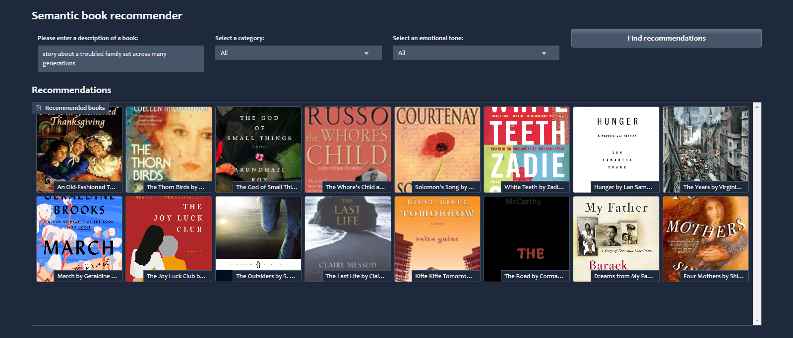
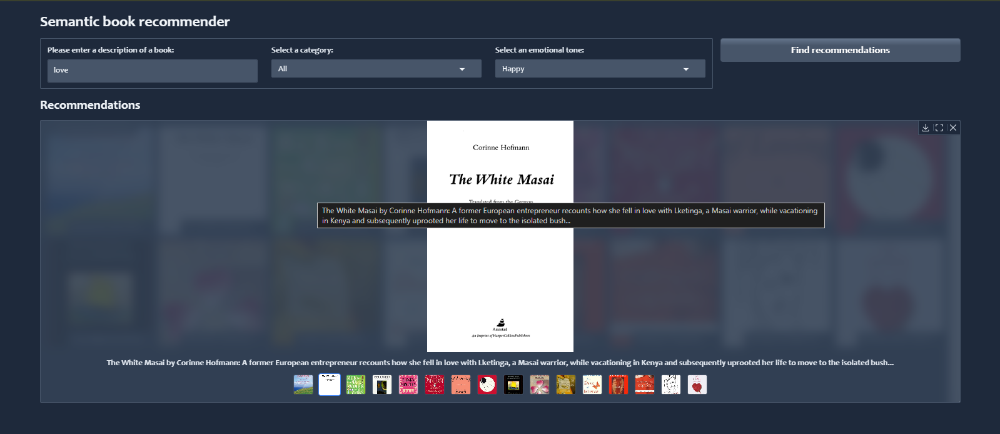

**Links** 

[Kaggle Dataset](https://www.kaggle.com/datasets/dylanjcastillo/7k-books-with-metadata)

[HuggingFace API Key](https://huggingface.co/settings/tokens)

[OpenAI API Key](https://platform.openai.com/settings/organization/billing/overview)

[HuggingFace](https://huggingface.co/facebook/bart-large-mnli) for Zero-Shot Classification

[HuggingFace NLP Course](https://huggingface.co/learn/nlp-course/chapter1/1) if you want to learn more about NLP's.

[More on fine-tunning](https://huggingface.co/learn/nlp-course/en/chapter3/1?fw=pt)

[Cohere API Key](https://dashboard.cohere.com/api-keys) An alternative to OpenAI, but the limit for the free tier is 100,000 tokens per month. So, for this project, it won't work unless you upgrade to a paid plan or reduce the size.

[Gradio](https://www.gradio.app/guides/quickstart)

-   If you're using OpenAI, remember to include a `.env` file with the `OPENAI_API_KEY`.

**Order of run**
-   data-exploration.ipynb
-   vector-search.ipynb
-   text-classification.ipynb
-   sentiment-analysis.ipynb
-   gradio-dashboard.py

**Enjoy!**